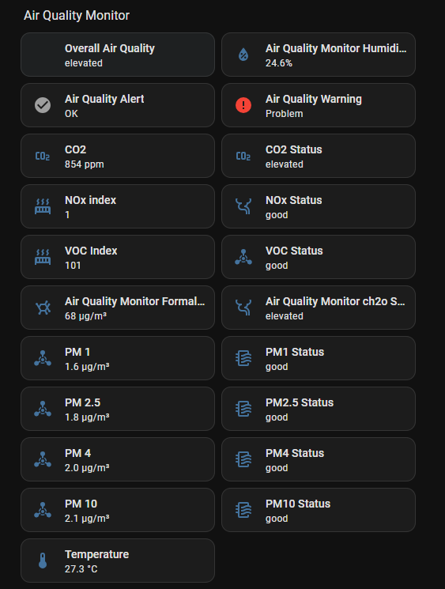
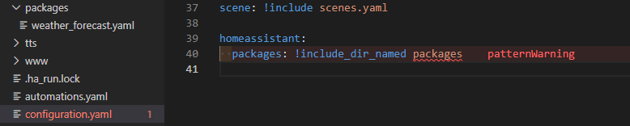
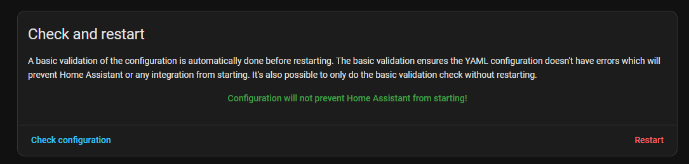
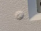
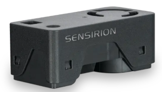
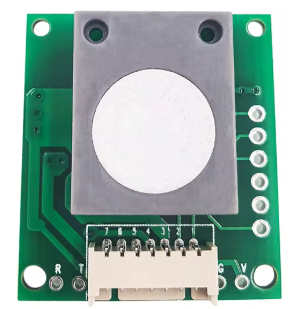
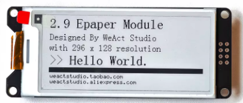
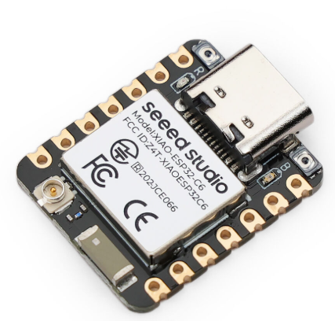
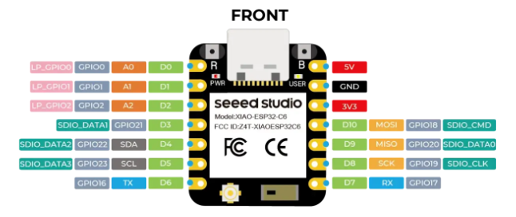

# Air Quality Monitor
This is a small Air monitor that monitors 

Particle size range	PM1.0, PM2.5, PM4 and PM10, Humidity, Temperature, CO₂, VOC, Formaldehyde.

Both reported on the Display and as a ESPHome device in Home Assistant 

The top 2 rows is Air quality oin the room, right on the lower line is local time, and temperature and humidity in the room. The right is the local forecast 4-5 hours ahead. 

The monitor has a set of elevated and critical thresholds, that both is reflected in Home assistant and the build in display: 
| Metric  |   Good    |  Elevated   |  Critical  |
| ------- | --------- | ----------- | ---------- |
| PM1     | <  5 ug/m | 5-15  ug/m  | > 15 ug/m  |
| PM2.5   | < 12 ug/m | 12-35 ug/m  | > 35 ug/m  |
| PM4     | < 15 ug/m | 15-40 ug/m  | > 40 ug/m  |
| PM10    | < 20 ug/m | 20-50 ug/m  | > 50 ug/m  |
| CO2     | < 800 ppm | 800-1200ppm | > 1200 ppm |
| VOC idx | < 150     | 150-250     | > 250      |
| NOx idx | <  20     | 20-150      | > 150      |
| CH2O    | < 50 ug/m | 50-100ug/m  | > 100 ug/m |
(WHO/EU guidelines; PM1+PM4 interpolated)

In Home assistant you also have a couple of aggregated statuses:

## Software
In Home assistant you need to add a Package file for the 5 hours forecast sensors.
Create a packages folder if it do not exists and then add the weather_forecast.yaml to that folder. Then change the configuration.yaml 
In Configuration.yaml file add 2 lines 
> homeassistant:   
>  packages: !include_dir_named packages

Ignore the patternWarning.

> #### **IMPORTANT!** - Before you restart Home assistant you MUST verify that the yaml file is OK. To do this go to  you do that by selecting Check Configuration  ion the developer tools - Do not proceed to restart Home assistant before you have a message like the green message bellow.
>

After that you just need to provision ESP32 Device and use this YAML file: [link](air-quality-office.yaml)

## Hardware

### **The case**
3D Model: [Bambulab](https://makerworld.com/en/models/2572064-air-quality-monitor#profileId-2835572)

You need:
- 4 Heat inserts - 3x3x4.5mm
- 4 3x5mm bolts (I only had 6mm length so I put a nut on top to make sure you do not do a dent in the front - ask me how I know :-
))    

- 4 or 8 Magnets 6x1.6mm

Other than that that the Processor and the sensors in a snap in hold.

### **Multi air quality Sensor**
   
Sensirion SEN66 : [SEN66 Data sheet](https://sensirion.com/products/catalog/SEN66) platform for PM, RH/T, VOC, NOx and CO2 measurements.
Connected through a simple I2C bus, and powered with 3.3v
This is available allot of places but I bought mine on [DigiKey.com](https://www.digikey.com/en/products/detail/sensirion-ag/SEN66-SIN-T/25700945?s=N4IgTCBcDaIM4FMB2A2FIC6BfIA)
Also remember that you need to by a cable for it e.g.: [DigiKey.com](https://www.digikey.com/en/products/detail/sparkfun-electronics/18079/14322699)

### **Formaldehyde sensor**
  
CH20 Sensor
[Aliexpress Link](https://www.aliexpress.com/item/1005010624393618.html?spm=a2g0o.order_list.order_list_main.89.12ff1802zN7YWK)
A small cheep Aliexpress sensor 

NOTE: Sensirion is launching a SEN69 that also have a formaldehyde sensor. I properly will upgrade to that single sensor when it becomes available.

### **ePaper display**
  
WeAct 2.9" black and white e-paper display, the display comes with a cable.  
[Aliexpress link](https://www.aliexpress.com/item/1005004644515880.html)

### **Processor**
  
Seeed ESP32c6 https://www.seeedstudio.com/Seeed-Studio-XIAO-ESP32C6-p-5884.html
I have chosen this MCU as it is my normal goto ESP, but this should run with any XIAO form factor (to fit the click holder) MCU supported by ESPHome.

## Wiring
More or less all wires is a one to one connection except Ground and 3.3v. Connect them like this:

## GPIO Usage Summary

| GPIO   | XIAO Pin | Function     | Bus       | Connected to     |
|--------|----------|--------------|-----------|------------------|
| GPIO00 | D0       | RST          | SPI       | e-Paper RST      |
| GPIO01 | D1       | CS           | SPI       | e-Paper CS       |
| GPIO02 | D2       | BUSY (input) | SPI       | e-Paper BUSY     |
| GPIO16 | D6       | UART TX      | UART      | ZE08 RX (pin 4)  |
| GPIO17 | D7       | UART RX      | UART      | ZE08 TX (pin 3)  |
| GPIO18 | D10      | SPI MOSI     | SPI       | e-Paper DIN      |
| GPIO19 | D8       | SPI CLK      | SPI       | e-Paper SCLK     |
| GPIO20 | D9       | SPI MISO     | SPI       | —  (unused)      |
| GPIO21 | D3       | DC           | SPI       | e-Paper DC       |
| GPIO22 | D4       | I²C SDA      | I²C       | SEN66 pin 2      |
| GPIO23 | D5       | I²C SCL      | I²C       | SEN66 pin 3      |

## Power Summary

| Rail  | XIAO Pin | Consumers                     | Max current |
|-------|----------|-------------------------------|-------------|
| 3.3 V | 3V3      | SEN66, e-Paper                | ~80 mA      |
| 5 V   | 5V       | ZE08-CH2O                     | ~150 mA     |
| GND   | GND      | SEN66, ZE08-CH2O, e-Paper     | shared      |

> The XIAO 3V3 pin can supply up to ~700 mA from the onboard regulator.  
> The 5V pin is VBUS (USB power) — not available when running on battery alone.

